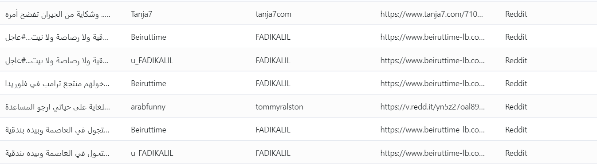

# Task 1 data srcaping Folder Details

This repository contains scrapper code to create data from Twitter tweets and Reddit posts, and to process it to get Iraqi dialect arabic sentences.

### Task Table

| No|  code/notebook file name | links and information | Contributor name |
|-|-|-|-|
|1|tweeter_data_cleaning_and_identify_iraqi_dialect.ipynb|() It is a code to remove diacritics, normalize alef variants to 'ا', normalize alef maksura 'ى' to yeh 'ي', normalize teh marbuta 'ة' to heh 'ه' and identify Iraqi dialect | Wael Abed|
|2|    API to scrape data using Twitter and Reddit     |  Depends on [Twint](https://github.com/twintproject/twint) for twitter scraping and [PRAW](https://github.com/praw-dev/praw)        |    Shyam Chanduri     |
|3|         |         |         |

This repository contains scrapper code to create data from Twitter tweets and Reddit posts in Arabic language.


## Dependencies
The code uses [Twint](https://github.com/twintproject/twint) for twitter scraping and [PRAW](https://github.com/praw-dev/praw) for scrapping Reddit content. Currently does not support scraping Reddit comments. Will add in future. Twint is under [MIT license](https://github.com/twintproject/twint/blob/master/LICENSE) while [PRAW is under [BSD 2-Clause Simplified License](https://github.com/praw-dev/praw/blob/master/LICENSE.txt). 


## Setup

This repository is create using Python version 3.9.6. 

### Conda

```
conda create --name gng_violence
conda activate gng_violence
pip install pandas
pip install praw
pip install git+https://github.com/twintproject/twint.git#egg=twint

```

### Clone
```
git clone https://dagshub.com/shyam573/Web-Scraping.git
cd Web-Scraping
```

### Reddit API
Reddit has made mandatory to create a custom API to fetch data. Follow this [link](https://towardsdatascience.com/scraping-reddit-data-1c0af3040768) to create a custom app with unique client id, unique client secret and user_agent on Reddit. Password and username are not required for the scrapper code to run. **This step is very important, without which data cannot be scraped using Reddit. Also, keep your credentials confidential.**


## Run
Run any of the following command to create data:
```
python sm_scraper.py   ## runs with default options. Check options.py
python sm_scraper.py --choices 0 1  ## creates data from both Twitter and Reddit

```
Check other options in ```options.py``` file to modify the created data.

## Sample Data
Sample data in ```data``` folder is created using ```11``` keywords from ```inputs``` folder. **This data do not contain labels.**


See created sample data below.




## Known Issues

1. Twint installation issues: Can be resolved by using the build from repo instead of PyPi package. Further issues can be found [here](https://github.com/twintproject/twint/issues).
2. Twint is not perfect. ```Lang()``` method in Twint is not ideal. Also, ```Location``` method does not work. Should be processed later after data collection.
3. Doesn't make use of GPU. And also runs sequentially.
4. Cannot control the number of text files from Reddit. Maximum that can be generated is approx. 250 per keyword only because of the Reddit API.
